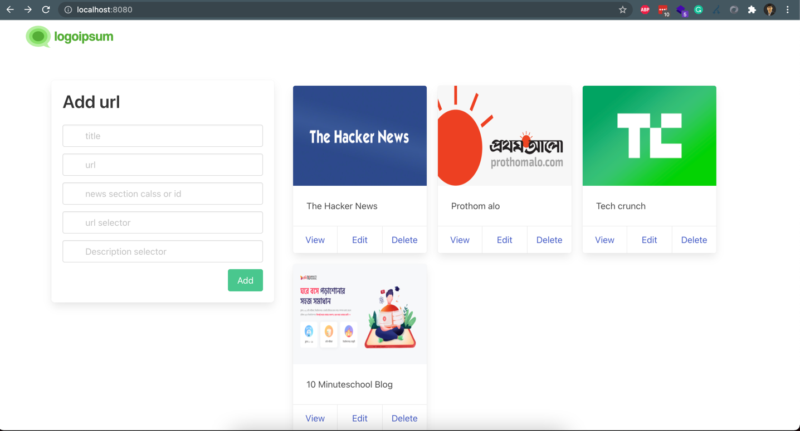
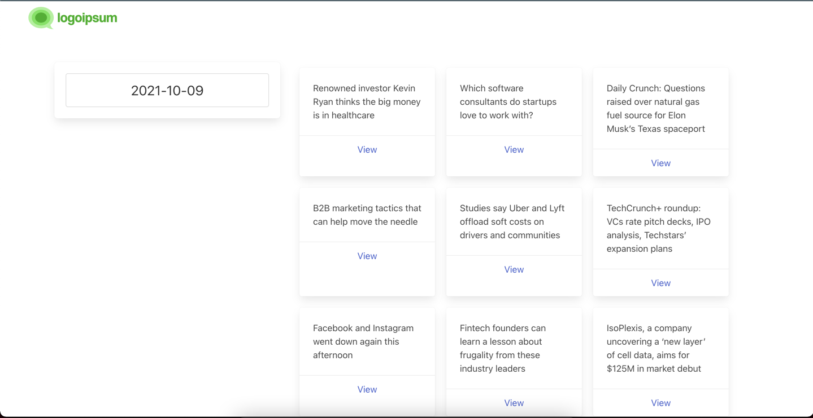

# News Pooler
News pooler is a news crawling application. It will crawl news from your given news link on a specific time. Very easy to use and easy to install.

# For whom?
- Love to read news but can't remember the website link
- Don't have time for searching news
- forget to bookmark 
- too lazy like me to ......

# Features
- Add news link 
- Connect any SQL based database
- Set crawl schedule time dynamically
- Filter News by date

# Demo

# Installations
- Clone the repository
- Move to the repository and open a terminal
- Run `` cp config-example.yml config.yml ``
- Run `` vim config.yml ``
- Set the desired value for your configurations and close the vim
- Run `` go build -o news-pooler `` it will create a file call news-pooler
- Run `` nohup ./news-pooler &`` it will run the application in the background
- Open the browser and go to your desired port you provided in config.yml file

# Contribution guideline
Make these things more useful by contributing our brain and efforts. History will remember our contribution as far as lazy peoples like me are alive ;)

- Clone the repository
- Create branch from master
- make changes
- push the branch
